# Ouroboros

LLM-enhanced SSH honeypot with adaptive response generation and automated attack classification.


## Overview

Ouroboros is a custom-built SSH honeypot that uses Google's Gemini AI to generate realistic terminal responses for any command an attacker types. Unlike traditional honeypots with hardcoded responses, Ouroboros dynamically adapts to attacker behavior, making it nearly impossible to fingerprint.

The system includes a real-time analytics dashboard with attack visualizations, automated session classification, and MITRE ATT&CK mapping.

### Key Features

- **Custom SSH Honeypot** — built from scratch with Python + Paramiko, not a Cowrie wrapper
- **Adaptive AI Responses** — Gemini 2.5 Flash-Lite generates realistic output for unknown commands in real-time
- **Automated Classification** — every session is classified by attack type, skill level, and severity
- **Real-time Dashboard** — React + D3.js with world map, heatmap, kill chain, session replay
- **MITRE ATT&CK Mapping** — AI-powered mapping of attacker techniques to the ATT&CK framework
- **Structured Logging** — all events logged as NDJSON for easy analysis

## Architecture

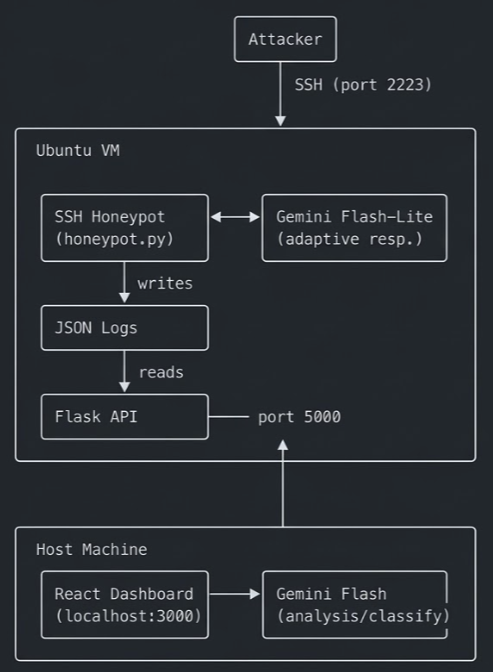

## Screenshots

## Screenshots

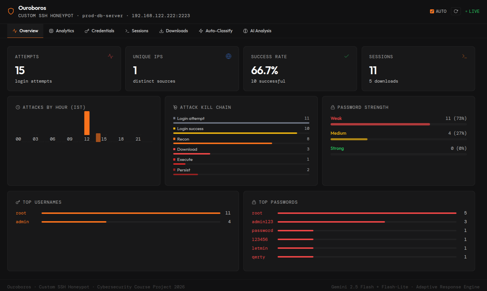

<table align="center">
  <tr>
    <td>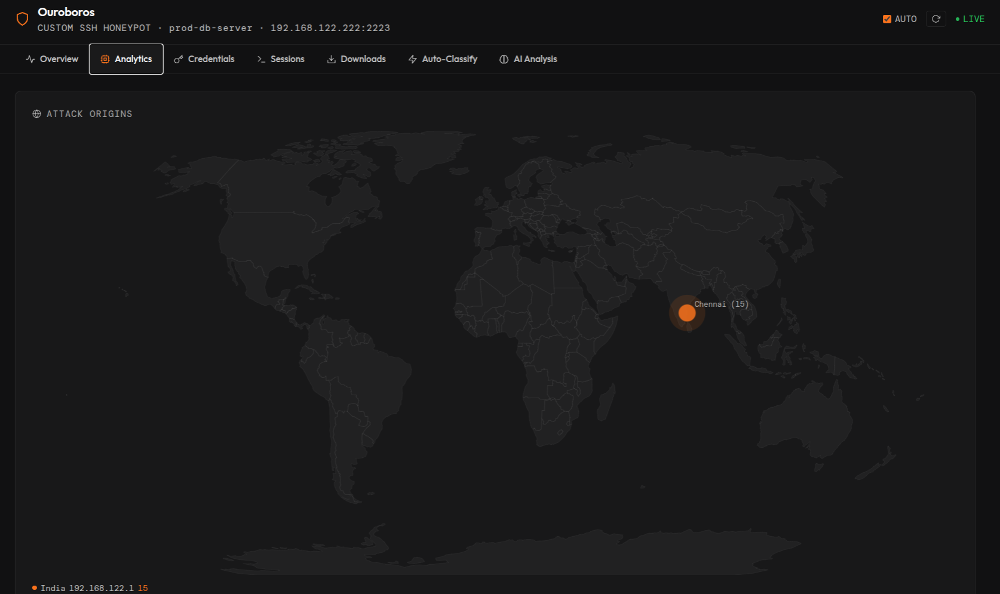</td>
    <td>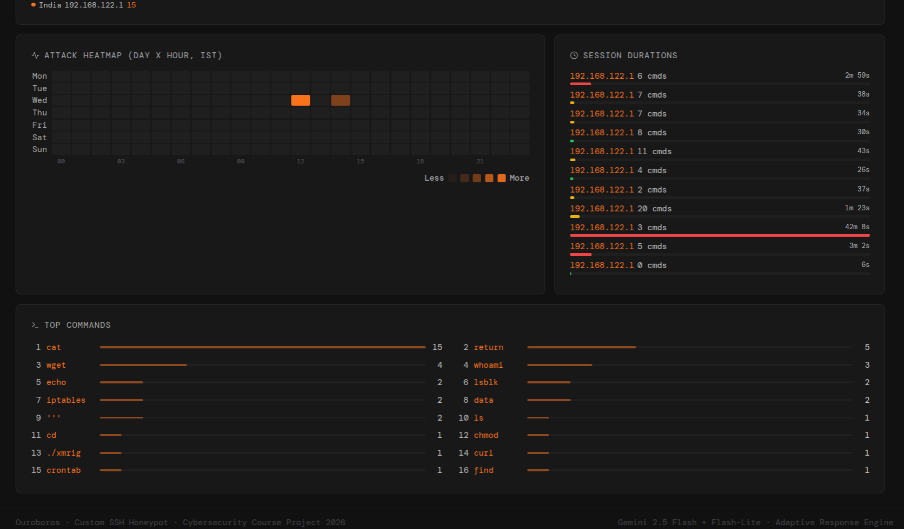</td>
    <td>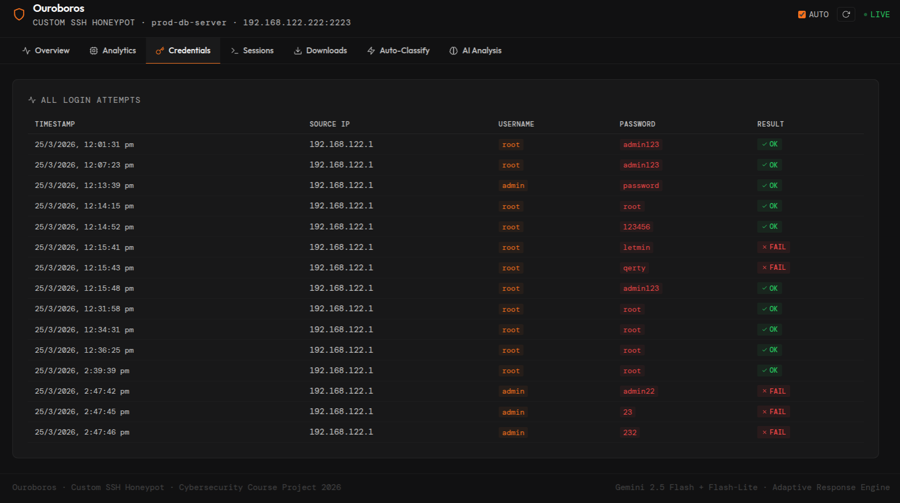</td>
  </tr>
  <tr>
    <td>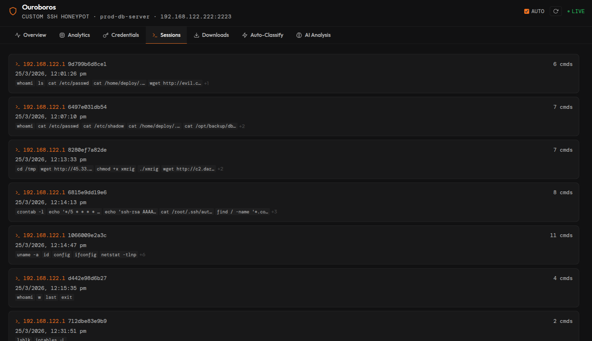</td>
    <td>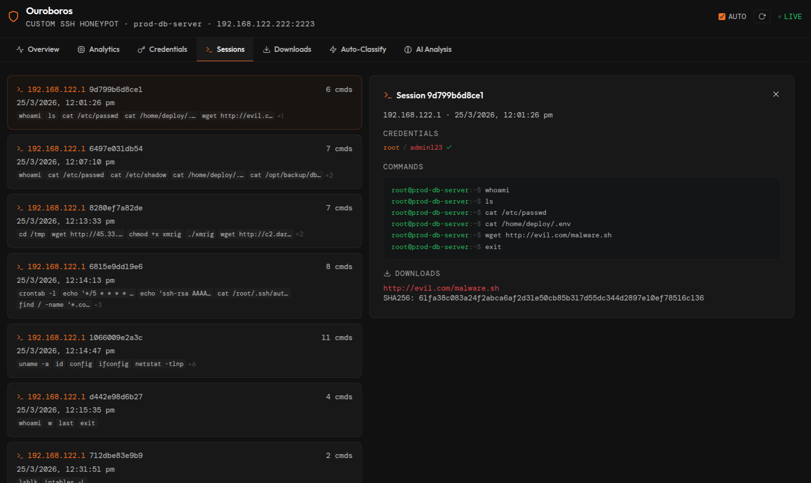</td>
    <td>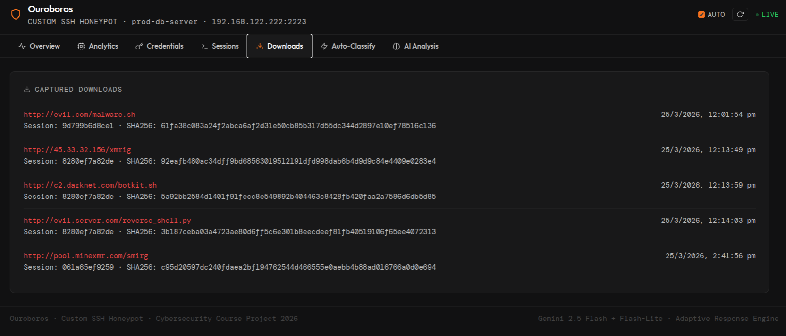</td>
  </tr>
  <tr>
    <td>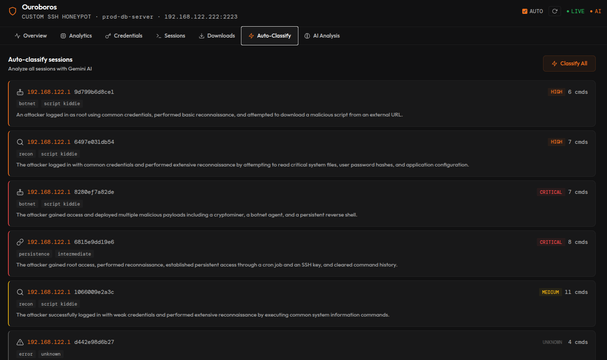</td>
    <td>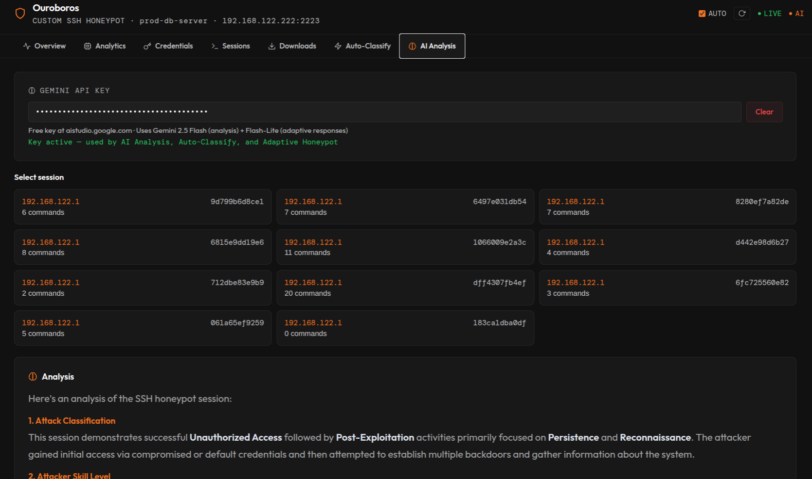</td>
    <td>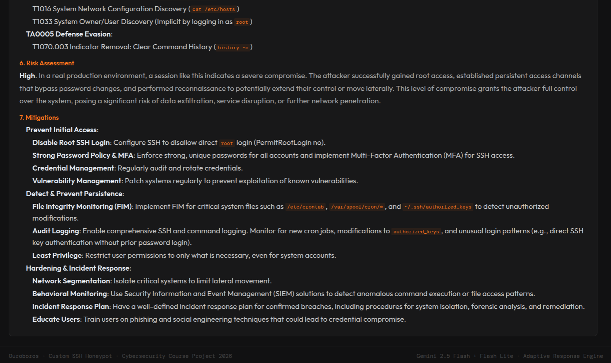</td>
  </tr>
</table>

## Quick Start

### Prerequisites

- Linux host with KVM/QEMU (for the VM) or any Ubuntu server
- Python 3.12+
- Node.js 18+
- Gemini API key ([get free key](https://aistudio.google.com))

### 1. Clone the repo

```bash
git clone https://github.com/yourusername/Ouroboros.git
cd Ouroboros
```

### 2. Set up the honeypot (on your server/VM)

```bash
cd honeypot
python3 -m venv venv
source venv/bin/activate
pip install -r requirements.txt

# Generate SSH host key (one-time)
python3 -c "import paramiko; k=paramiko.RSAKey.generate(2048); k.write_private_key_file('honeypot_rsa_key')"

# Configure credentials in honeypot.py (VALID_CREDENTIALS dict)

# Start the honeypot
export GEMINI_API_KEY="your_key_here"
python3 honeypot.py
```

### 3. Set up the backend API (on the same server/VM)

```bash
cd ../backend
python3 -m venv venv
source venv/bin/activate
pip install -r requirements.txt

# Update the log file path in app.py to match your honeypot's location
python3 app.py
```

### 4. Set up the dashboard (on your local machine)

```bash
cd ../dashboard
npm install

# Update API_BASE in src/HoneypotDashboard.jsx to point to your server IP
npm start
```

### 5. Test it

```bash
ssh root@your-server-ip -p 2223
# Use credentials configured in VALID_CREDENTIALS
```

## Configuration

### Honeypot (honeypot/honeypot.py)

| Setting | Default | Description |
|---------|---------|-------------|
| `PORT` | 2223 | SSH listen port |
| `HOSTNAME` | prod-db-server | Fake hostname shown to attackers |
| `VALID_CREDENTIALS` | see config | Username/password pairs that allow login |
| `GEMINI_MODEL` | gemini-2.5-flash-lite | Model for adaptive responses |

Credentials, fake filesystem contents, and static command responses are all configurable in `honeypot.py`.

### Backend (backend/app.py)

| Setting | Default | Description |
|---------|---------|-------------|
| `HONEYPOT_LOG` | path to honeypot.json | Log file location |
| Port | 5000 | Flask API port |

### Dashboard (dashboard/src/HoneypotDashboard.jsx)

| Setting | Default | Description |
|---------|---------|-------------|
| `API_BASE` | http://your-server:5000/api | Flask API URL |
| `HOSTNAME` | prod-db-server | Display hostname |

## API Endpoints

| Endpoint | Method | Description |
|----------|--------|-------------|
| `/api/overview` | GET | Summary statistics |
| `/api/login_attempts` | GET | All login attempts |
| `/api/credentials` | GET | Top usernames and passwords |
| `/api/sessions` | GET | All sessions with commands |
| `/api/session/<id>` | GET | Single session details |
| `/api/downloads` | GET | Captured file downloads |
| `/api/timeline` | GET | Hourly attack counts |
| `/api/heatmap` | GET | Day x hour attack grid |
| `/api/command_freq` | GET | Command frequency |
| `/api/password_strength` | GET | Password categorization |
| `/api/kill_chain` | GET | Attack kill chain stages |
| `/api/session_durations` | GET | Session duration data |
| `/api/geo_attacks` | GET | Geolocation of attackers |
| `/api/classify` | POST | AI classification of all sessions |

## Dashboard Tabs

| Tab | Description |
|-----|-------------|
| **Overview** | Stat cards, hourly chart, kill chain, password strength, top credentials |
| **Analytics** | D3.js world map, day x hour heatmap, session durations, command frequency |
| **Credentials** | Full login attempt table with results |
| **Sessions** | Session list with terminal-style command replay |
| **Downloads** | Captured malware URLs and SHA256 hashes |
| **Auto-Classify** | One-click AI classification of all sessions |
| **AI Analysis** | Deep per-session analysis with MITRE ATT&CK mapping |

## How the Adaptive Layer Works

1. Attacker types a command (e.g., `iptables -L`)
2. Honeypot checks static response database (30+ pre-built responses)
3. If no match, sends the command + server context to Gemini 2.5 Flash-Lite
4. AI generates realistic terminal output indistinguishable from a real server
5. Response is sent back to the attacker and the event is logged

## Tech Stack

| Component | Technology |
|-----------|-----------|
| SSH Honeypot | Python 3.12, Paramiko |
| Backend API | Flask, Flask-CORS |
| Frontend | React 18, D3.js, TopoJSON |
| AI (Adaptive) | Gemini 2.5 Flash-Lite |
| AI (Analysis) | Gemini 2.5 Flash |
| Infrastructure | Ubuntu 24.04, KVM/QEMU |

## Detailed Setup Guide

For a complete step-by-step guide including VM creation, see [SETUP.md](SETUP.md).

## Disclaimer

This tool is for **educational and research purposes only**. Do not expose to the public internet without understanding the security implications. The authors are not responsible for any misuse.

## License

This project is licensed under the MIT License - see the [LICENSE](LICENSE) file for details.
